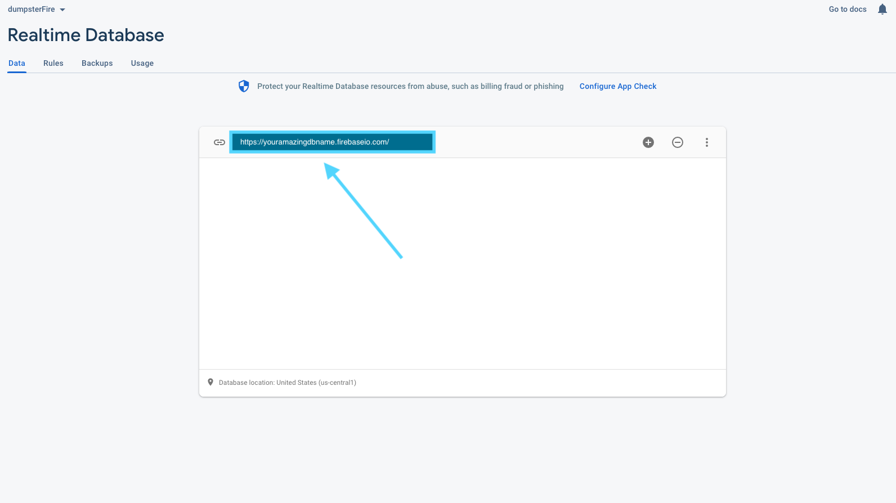

# Contributing! 🥳

Thank you so much for considering to contribute to Code School Q&A

**REMEMBER: Please don't be afraid to break it. Break it, fix it, get help, learn from it, make friends and share it 🙌**

## 🤗 Getting Started

<hr/>

## 💻 Software Requirements

1. A code editor such as VSCode to view and edit the code
2. [Node](https://nodejs.org/en/download/)
3. [Firebase](https://firebase.google.com/)

**Firebase Set Up 🔥**

- Go to the firebase console and log in/create account
- Create a firebase project
- You can disable Google Analytics for this project
- Click Create! 👾
- Click on Realtime Database and click Create Database
- You can leave the default for the location setting
- On Security rules please choose Start in **Test Mode**
- Click Enable
- You are all set up! 🥳

<div align="center">

</div>

## 🤝 Ready friends?

<hr/>

- Fork this repo
- Click on the <span style="background-color:green;color:white;padding:5px;border-radius:5px">Code</span> button and copy the repo URL
- Open your terminal and use the command `git clone https://github.com/carmenkolohe/CodeSchoolQA.git` into the directory you would like to have the repository
- Open in text editor to view code and make changes

- **Please create a `.env.local` file in the main directory and store your Firebase URL as an environmental variable. Please make sure to end the URL with `/questions.json` and prefix the variable with `NEXT_PUBLIC_`. You will be able to use this anywhere in the code and it is already included in .gitignore because... Next.js magic 🪄 . If you would like to learn more about Environmental Variables in Next.JS, [Click Here](https://nextjs.org/docs/basic-features/environment-variables) to read the documentation**
- Example:

  ```// .env.local
  NEXT_PUBLIC_FIREBASE_URL=https://your-firebase-url.firebaseio.com/questions.json
  ```

<div align="center">
<details>
<summary>Click here. Pictures make things better</summary>

</details>
</div>

- Open terminal and navigate to dumpster-fire directory
- Use the command `npm install` to install all necessary packages for the project to function
- Use the command `npm run dev` and go to localhost:3000 and you should be able to see the project so far!

If all is set up correctly with your API URL you should be able to submit a question and see it update the list.

**Initially you will not see a list of questions because, you don't have any stored in your database but, you can test to make sure all is right in the world by entering a question and clicking ask us. A thank you pop up will show up and once you click 'KK thanks friends!' it should update the list and you will be able to see it below the Ask us! button.**

## 🧐 Don't see your issue? Open one

<hr/>

If you spot something new, open an issue using a [template](https://github.com/github/docs/issues/new/choose). We'll use the issue to have a conversation about the problem you want to fix.

## 🆕 Staying up to date

This is something that was confusing to me when I first started contributing to open source. I hope I can explain it well.

If you are working on a issue and it is taking some time (First of all, no worries) you will want your code to stay current to the code. You can create an upstream branch that will sync changes you make in a forked repository with the original repo. If this is confusing please check out [Configure remote fork](https://docs.github.com/en/github/collaborating-with-pull-requests/working-with-forks/configuring-a-remote-for-a-fork) and [Syncing a fork](https://docs.github.com/en/github/collaborating-with-pull-requests/working-with-forks/syncing-a-fork).

1. Open your terminal
2. Use the command `git remote -v` to see the current remote repos

```
$ git remote -v
> origin  https://github.com/YOUR_USERNAME/YOUR_FORK.git (fetch)
> origin  https://github.com/YOUR_USERNAME/YOUR_FORK.git (push)
```

3. Create a new remote called `upstream` that will be synched with the fork
   `$ git remote add upstream https://github.com/ORIGINAL_OWNER/ORIGINAL_REPOSITORY.git`

4. Verify

```
$ git remote -v
> origin    https://github.com/YOUR_USERNAME/YOUR_FORK.git (fetch)
> origin    https://github.com/YOUR_USERNAME/YOUR_FORK.git (push)
> upstream  https://github.com/ORIGINAL_OWNER/ORIGINAL_REPOSITORY.git (fetch)
> upstream  https://github.com/ORIGINAL_OWNER/ORIGINAL_REPOSITORY.git (push)
```

## 🤙 Submitting a PR

<hr/>

[Atlassian's Git Workflow](https://www.atlassian.com/git/tutorials/comparing-workflows)

There is a main branch, a develop branch, and a feature/feature-name or bug/bugfix-name branches for development of the app.

**Process to PR submission:**

1. Fork the repo
2. Create a new branch under the `feature/` flag
3. Name the branch in a descriptive way that says what it does (ex:`feature/add-login`)
4. Create your PR into the `develop` branch
5. Leave a short message in the PR explaining in more detail what the PR is accomplishing
6. Ask questions, have fun, and learn. We are all friends here.

## 🪄 Your PR is merged!

<hr/>

Congratulations! The community thanks you. 🦄
